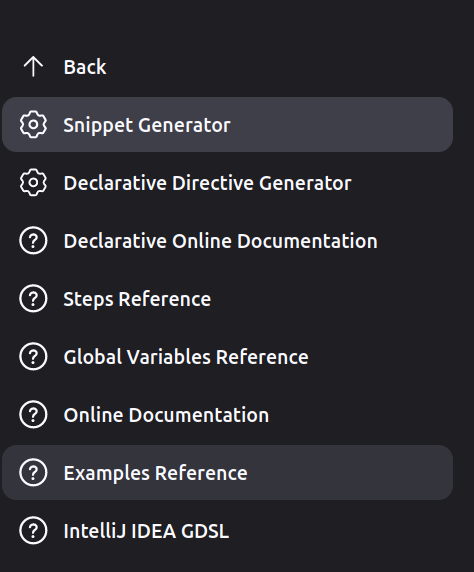
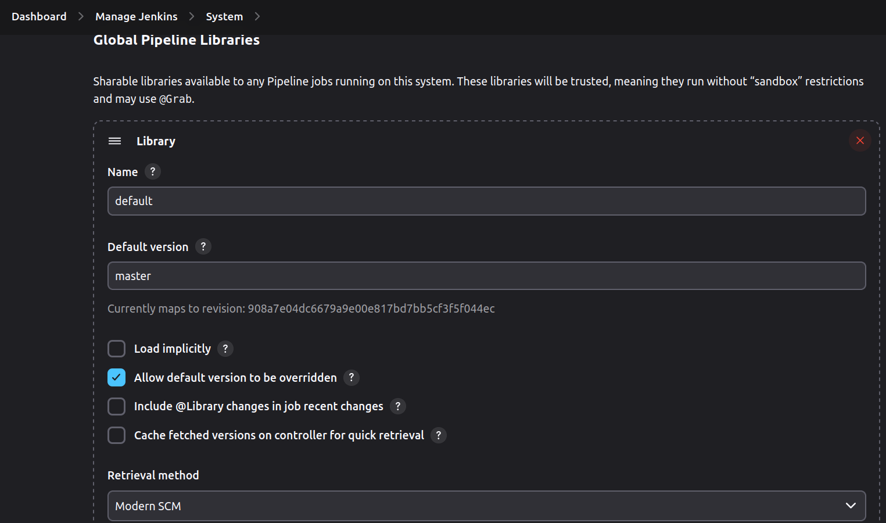

# Sonar, OWASP, Trivy and Jenkins Advanced
## By Jakub Pustelnik and Bartosz Koziak

---
# Agenda
* Jenkins Shared Libraries
* Pipeline Jobs composition
* Configuration as a Code
  * Multibranch Pipeline
  * Organization Pipeline
  * Casc Plugin
* Best Practices

---
https://github.com/pustelnik/training-jenkins-advanced


---
<style scoped>section { font-size: 20px; }</style>
# Extending with Shared Libraries
We don't want to copy the same pipeline code every time we add new project to Jenkins. Using Shared Libraries we can:
* Write custom steps e.g. app.deploy()
* Create a pipeline template

Jenkins have built-in step library, review **Pipeline Syntax** for details.

**Remember to never override built-in steps like stage/steps etc.**


---
# Jenkins Built-in Step Example
## stage
```groovy
node {
  stage('Build') {
    ...
  }
}
```
## archiveArtifacts
```groovy
archiveArtifacts artifacts: 'target/*.jar', followSymlinks: false
```

---
# Jenkins Built-in Step Example
## readFile and echo
```groovy
node {
  stage('Build') {
    def exampleFile = readFile 'example.txt'
    echo exampleFile
  }
}
```

---
<style scoped>section { font-size: 20px; }</style>
# Extending with Shared Libraries
To create a shared library we need:
1. Git repository that follows required directory structure
   ```shell
   (root)
    +- src                     # Groovy source files
    |   +- org
    |       +- foo
    |           +- Bar.groovy  # for org.foo.Bar class
    +- vars
    |   +- foo.groovy          # for global 'foo' variable
    |   +- foo.txt             # help for 'foo' variable
    +- resources               # resource files (external libraries only)
    |   +- org
    |       +- foo
    |           +- bar.json    # static helper data for org.foo.Bar
   ```
2. Load shared library
   1. Globally for all jobs
   2. Per Folder
   3. Dynamically without predefinding in configuration

---
# Global Shared Library Configuration


---
# Dynamically Loaded Shared Library
Inside pipeline code add:
```groovy
library(
  identifier: 'training-simple-shared-library@main', 
  retriever: modernSCM(
    [
      $class: 'GitSCMSource', 
      // uncomment if credentials are required
      // credentialsId: 'github-ssh-private-key'
      remote: 'https://github.com/pustelnik/training-simple-shared-library.git', 
      traits: [gitBranchDiscovery()]
    ])
)
```

---
# Live Demo
* sources https://github.com/pustelnik/training-simple-shared-library

---
# Lab #1 Shared Library
Prepare a global shared library with steps:
1. `maven.owasp()` - runs OWASP Dependency Check with Maven
2. `maven.sonar()` - runs SonarQube Analysis with Maven
3. `trivy.scan()` - runs Trivy Image scan using [trivy docker image](https://hub.docker.com/r/aquasec/trivy/)

---
# Pipeline Jobs Composition
With Jenkins Pipeline users cannot rebuild stage. Starting all over again in case of long running tests can be painful. Using Jenkins `build` step, we can schedule another job from pipeline and wait for results.
```groovy
stage('job 01') {
    steps {
        build '01-simple'
    }
}
```
---
# Build Job with Parameters
```groovy
stage('job 08') {
    steps {
        build job: '08-parameters', parameters: [
            string(name: 'PERSON', value: 'Mr Jenkins'),
            text(name: 'BIOGRAPHY', value: ''),
            booleanParam(name: 'TOGGLE', value: true),
            string(name: 'CHOICE', value: 'One'),
            password(name: 'PASSWORD', description: 'Enter a password', value: '<DEFAULT>')
        ]
    }
}
```

---
# Lab #2 Job Composition
1. Create a job that will run trivy image scan based on `images` - `string` parameter
2. Create second job that will trigger previously created job to scan at least one docker image
3. Copy Trivy report from triggered job using `copyArtifacts` built-in step, and attach it to second job

---
# Configuration as a Code (Live Demo)
**Pipelines**
* multibranch
* organization folder

**Plugins**
* https://plugins.jenkins.io/configuration-as-code/
* https://plugins.jenkins.io/job-dsl/

---
# Configuration as a Code Example
https://github.com/pustelnik/jenkins-training-environment


---
# Best Practices
* Keep shared library small
* Remember that Jenkins Shared Library code is still a code, **it needs to be tested**
* Don't override built-in steps
* Use Pipeline code as a glue
* Remember about **KISS** and **DRY**
* Follow https://www.jenkins.io/doc/book/pipeline/pipeline-best-practices/
* Never implement https://github.com/auchenberg/volkswagen

---
# Lab #3 (or Homework)
To existing jobs add following:
* Maven cache (we don't want to pull same dependencies all the time we run jenkins job)
* Trivy cache
* Report build status on Github Pull Requests


---
# Thank you!

jakub.pustelnik@idemia.com